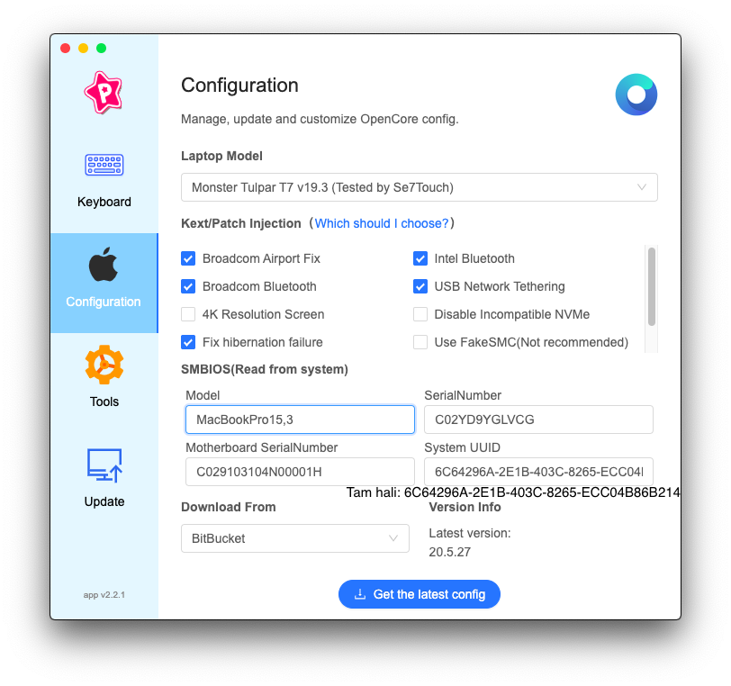
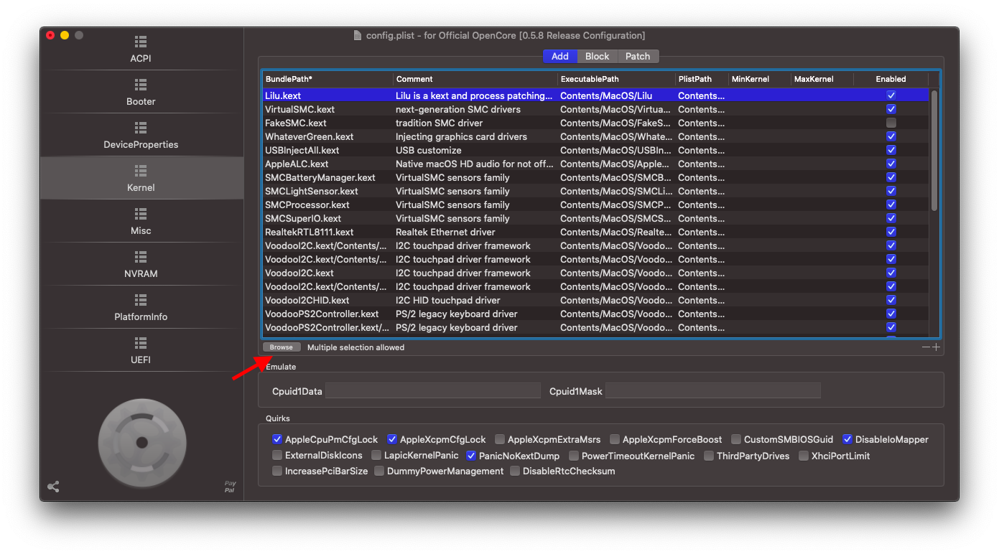
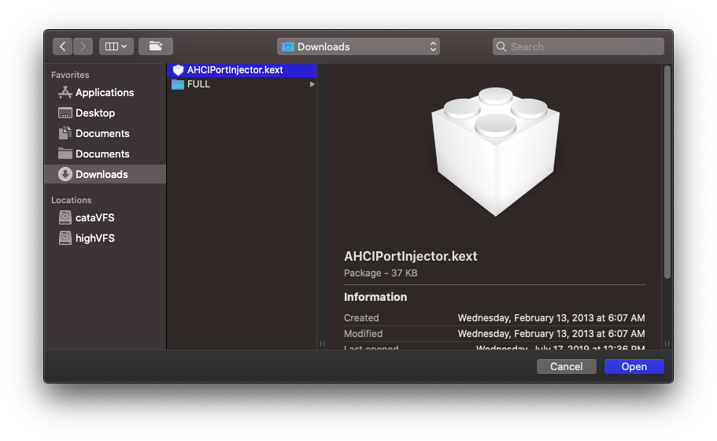
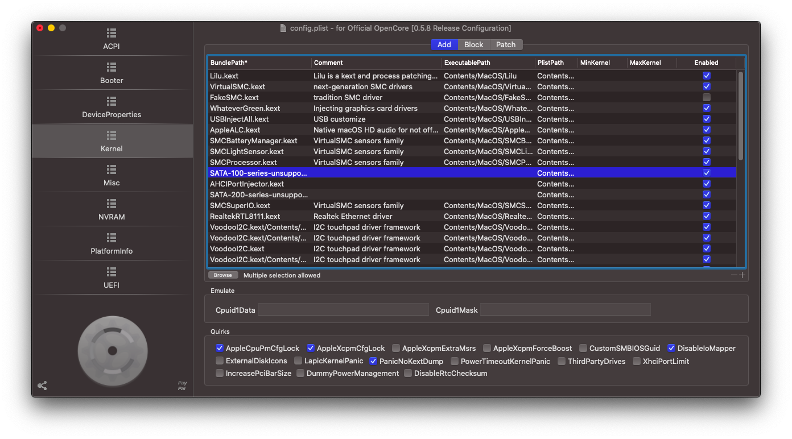
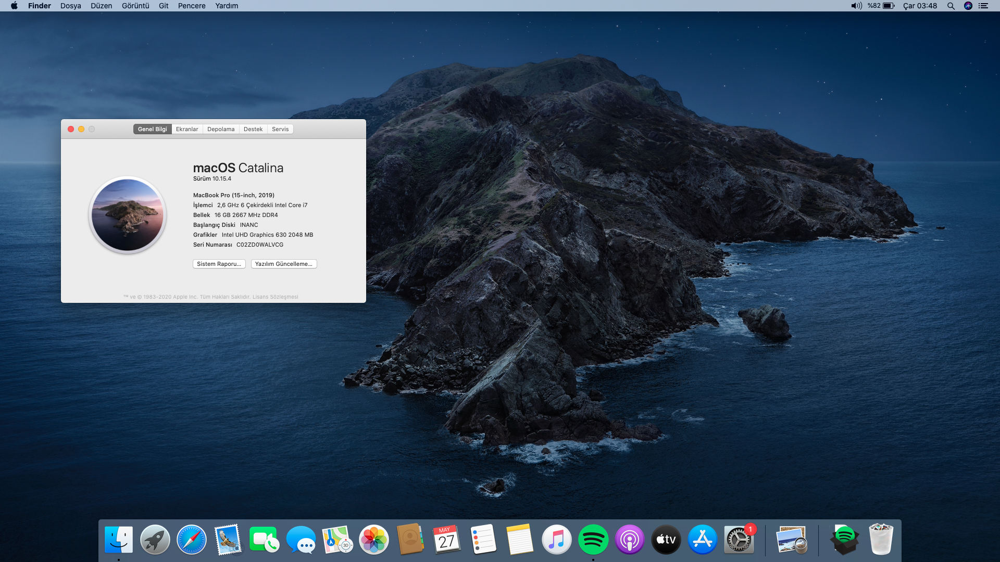

# MONSTER Tulpar T7 V20.1  | Intel® Core™ i7 serisi (9th)

[](https://github.com/sutsurup/MONSTER-Hackintosh/releases) [](#i̇letişime-geçin)

Türkçe | [English](README_EN.md)

**Bu rehberi takip ederek, [kirainmoe](https://github.com/kirainmoe) tarafından düzenlemiş OpenCore Bootloader ile Monster Tulpar T7 V20.1 cihazınızda macOS çalıştırmanız mümkün - macOS 10.15.4 sürümünde test edilmiştir**

**Farklı model bir Monster cihazınız varsa ve *"Barebone" numarası da tutarsa*, bu rehberi uygulayabilirsiniz. Rehberin son bölümünde nasıl kontrol edeceğinizi belirttim.**


# Detaylar

    Tarih:        Mayıs 27, 2020
    Durum:        Stabil
    Destek:       BIOS (N.1.04)
    Yapı:         OpenCore Bootloader (+ACPI hotpatch [RehabMan]) kullanılarak, kirainmoe dosyaları ile sutsurup  tarafından Tulpar T7 V20.1 cihaza uygulanmıştır

## Donanım

| **MONSTER** | Detay                                                  |
| ------------------- | ------------------------------------------- |
| Model Ismi      | Monster Tulpar T7 V20.1      |
| Anakart           | Intel Cannon Point HM370     |
| CPU              | Intel(R) Core(TM) i7-9750H CPU @ 2.60GHz (max. 4.50GHz) Coffee Lake-H              |
| RAM           | A-Data 16 GB 2666 MHz DDR4 SDRAM    |
| Dahili Grafik Kartı | Intel(R) UHD Graphics 630 (1 GB)                     |
| Wi-Fi             | Intel(R) Wireless-AC 9560 802.11n |
| Kamera          | HD Webcam           |
| Ses       | Realtek ALC269                        |
| BIOS Versiyonu      | N.1.04                   |

# Eklenen donanım(lar)

    WDC WD10SPZX (1 TB, 5400 RPM, SATA-III) | https://cnet.co/3gpFi97

> HDD, depo vazifesi görmesi için kasaya sonradan monte edilmiştir, kasada HDD veya SATA SSD için yuva mevcut

# Desteklenmeyen donanımlar

    1. Harici Ekran Kartı (NVIDIA GeForce GTX 1660 Ti) [Apple desteklemiyor]
    2. Intel(R) Wireless-AC 9560 (Wi-Fi kartı) [Apple desteklemiyor] -Yazının devamında çözümü var-

## Uyumluluk
**macOS Catalina 10.15.4** sürümünü desteklemektedir.
macOS High Sierra 10.13.6 veya Mojave 10.14.6 sürümlerinde çalıştırmayı deneyebilirsiniz

## Yedeklerinizi alın
**Yükleme talimatlarına geçmeden önce;** Sistemde kurulu Windows, Linux veya benzeri bir işletim sistemi var ise her ihtimale karşı **önemli yedeklerinizi almayı unutmayın.** Yanlış diski silme veya diski **APFS formatlama** esnasında disk yapısı bozulabilir. Yedeklerinizi [Yandex.Disk](https://disk.yandex.com.tr) tarzı çevrimiçi bir depolama alanına veya (var ise) harici diskinize depolamanızı öneririm.

## Kurulum öncesi yapılması gerekenler
* [Etcher](https://www.balena.io/etcher/) programının işletim sisteminize uygun olan versiyonunu indirin
* KaoS tarafından paket haline getirilen, macOS kurulumu için gerekli olan RAW kurulum dosyasını ([OSXINFO sitesinden](https://osxinfo.net/konu/macos-catalina-amd-intel-kurulum-imaji.10455) indirin | Link konunun alt taraflarındadır
* [Kirainmoe uygulaması](https://github.com/kirainmoe/tongfang-hackintosh-utility/releases)nı indirin ve sisteme uygun EFI klasörünüzü indirin 
 

        Ekran görüntüsünde gözüktüğü gibi seçimleri tamamlayın, "Get the latest config" butonuna basın.
        Ben macOS uygulamasını kullandım, siz dilerseniz Windows versiyonunu indirebilirsiniz.
	
        Önemli!
        SerialNumber, MotherBoard SerialNumber ve System UDID numaraları rastgele oluşturulmuştur.
        Bu bilgileri mutlaka, kurulum sonrasında;
        Bu rehberdeki "Kurulum sonrası" bölümünün ilk maddesinde anlatıldığı gibi değiştirin!

### HDD kullanacaklar için

1. macOS'i HDD üzerine kuracaksanız ve kurulum aşamasında HDD diskiniz görünmüyorsa:

	- [issues](https://github.com/sutsurup/MONSTER-Hackintosh/issues) üzerinden destek bileti açın
	- Güncel kirainmoe dosyalarına desteklenmeyen HDD diskler için yama yapılması gerekiyor, yardımcı olmaya çalışırım

2. Sistemde depolama amacıyla HDD kullanacaksanız ve kurulum sırasında HDD diskiniz görünmediyse, kurulumu tamamladıktan sonra rehberdeki "Kurulum sonrası" bölümünün son maddesini uygulayın

# macOS Yükleme Talimatları


1. BIOS ekranına girin ve aşağıdaki değerleri değiştirin (F7 tuşu BIOS menüsüne girmeye yardımcı olur):

	- SATA modunu AHCI seçin (varsayılan Intel yazar)
	- Intel Virtualization Teknolojisi devre dışı bırak
	- Secure Boot devre dışı bırak

2. macOS kurulumunu başlatabilmek için USB belleğinize MAC kurulum dosyasını (RAW) Etcher programı yardımıyla yazdırın
3. Kirainmoe uygulaması tarafından Masaüstünüze çıkarılan TongFang_EFI klasöründe bulunan BOOT ve OC klasörlerini kopyalayın, USB belleğin EFI diskindeki EFI klasörü içerisindeki BOOT ve CLOVER klasörlerini silin, önceden kopyaladığınız BOOT ve OC klasörlerini buraya yapıştırın
4. Cihazı yeniden başlatın ve başlatma düğmesine basar basmaz F7 tuşuna basın. USB belleği seçerek devam edin ve macOS installer'ı seçin
5. Toucpad çalışmayabilir - USB Mause kullanabilirsiniz
6. macOS sistemini Windows yanına kuracaksanız, [bu rehber'de yapıldığı gibi](https://www.youtube.com/watch?v=nvXew__fuQE) Apple HFS diski oluşturmanız gerekiyor. Kurulum aşamasında bu diski seçerek ilerleyeceksiniz.
5. Cihazda sadece macOS kullanacaksanız, kurulum ekranı geldiğinde "Disk Izlencesi" bölümüne gidin, sol üstteki "Görüntü" yazısının üzerindeki butona basın ve tüm diskleri göster deyin. Bu sayede alt tarafta HDD/SSD donanımınız gözükecek. "Samsung SSD" gibi. Buna tıklayın ve sonrasında sağ tarafta bulunan "Sil" butonuna tıklayın. Biçim olarak "APFS", Düzen olarak "GUID Bölüntü Haritası" seçeceksiniz ve tekrar sil deyin. Işlem tamamlandığı zaman bu pencereyi kapatın ve kuruluma normal şekilde devam edin, yeni oluşturduğunuz APFS diskini seçin. Kurulum bittikten sonra cihaz yeniden başlayacaktır. Son yaptığınız işlemden sonra artık "macOS installer" seçmeyeceksiniz. Yeniden başladığı zaman 4. adımda yaptığınız gibi tekrar USB belleği seçin ve bu sefer yeni oluşturduğunuz APFS diskini seçin.  Bilgisayar her yeniden başladığında, yeni oluşturduğunuz APFS diski seçeceksiniz.  Kurulumun kalan kısmı bittiği zaman sistem kullanıma hazır hale gelecektir.

Sistemi yeni kurduğunuzdan dolayı ilk birkaç açılışta kendi içinde ayarlarını yapmaktadır. Bu sebeple yavaş açılabilir.
Sabırlı olun.
```
$ Destek almak için paylaştığım mail adresinden bana ulaşabilirsiniz.
``` 

# Kurulum sonrası yararlanabileğiniz rehber/araçlar (Isteğe bağlı)
* önerilir: iCloud'a giriş yapacaksanız veya iMessage, FaceTime kullanmak istiyorsanız, bu rehberi harfiyen uygulayın: [Hackintosh Cihazlarda iMessage Etkinleştirmek](https://osxinfo.net/konu/hackintosh-cihazlarda-imessage-etkinlestirmek.84) (Bu rehberde Clover Configurator gösterilmiş, siz OpenCore Configurator kullanacaksınız, Clover Configurator üzerinden takip edin, verileri OpenCore Configurator aracılığıyla config.plist dosyanıza girin)
* [OpenCore Configurator](https://mackie100projects.altervista.org/download-opencore-configurator/) (config.plist düzenlemek için)
* Hackintool ([Forum thread](https://www.insanelymac.com/forum/topic/335018-hackintool-v286/) | [Direkt indirme linki](http://headsoft.com.au/download/mac/Hackintool.zip)) (Detaylı sistem bilgileri öğrenme ve düzenlemeleri için)
* Kext Updater ([Indir](https://bitbucket.org/profdrluigi/kextupdater/downloads/) | [Forum](https://www.hackintosh-forum.de/forum/thread/32621-kext-updater-neue-version-3-x/) {Alman})
* Sistemde HDD kullanacaksanız ve kurulumda görmüyorsa belirteceğim yamaları kullanmalısınız. HDD kullanmayacaksanız bu maddeyi uygulamayın.
<details>
<summary>HDD Tanıtma Talimatları</summary>

Yamaları config.plist dosyanıza tanıtmak için [OpenCore Configurator](https://mackie100projects.altervista.org/download-opencore-configurator/) uygulamasını kullanacağız. Bu sebeple öncelikle kurulumu tamamlamalısınız, sonrasında HDD'yi tanıtın.

Belirttiğim bu yamaları indirin ve zip'ten çıkarın. (MACOSX klasörü varsa içerisinde bunu çıkarmayın, önemli değil. Kext dosyasını doğru çıkarıp çıkarmadığınızı kontrol etmek için, sağ basıp özellikler deyin, dosya türü KEXT olmalı)
$ [AHCIPortInjector.kext](https://osxinfo.net/eklentiler/ahciportinjector-kext-zip.10163/), [SATA-100-series-unsupported.kext](https://osxinfo.net/eklentiler/sata-100-series-unsupported-kext-zip.3551/), [sata-200-series-unsupported.kext](https://osxinfo.net/eklentiler/sata-200-series-unsupported-kext-zip.3550/) kextlerini indirin

İndirdiğiniz bu yamaları, EFI klasöründe OC > Kexts dizinine yükleyin

Sonrasında OpenCore Configurator uygulamasını açın ve sol üstten File > Open deyip, USB belleğinizde EFI diskinde EFI > OC > config.plist dosyasını açın

Sol menüde Kernel içerisinde "Browse" butonuna basın


Açılan pencerede sırayla indirdiğiniz kext dosyalarını seçin, üçünü de bu şekilde ekleyin


Kext dosyalarını config.plist dosyamıza da tanıtmış olduk, kaydedin ve çıkın. Sistemi yeniden başlattığınızda HDD gözükecektir

</details>

# Wi-Fi nasıl kullanırım?
Hackintosh işlemleriyle uğraşan bir ekip, [OpenIntelWireless](https://github.com/OpenIntelWireless) adında bir proje yaptılar. Bu projenin amacı Intel Wireless kartlarını sisteme tanıtmak. Şu anda tam kararlı bir şekilde belirli Intel marka Wireless kartları Hackintosh sistemlerde çalışmaktadır.
Bu listeye ulaşmak için [bu bağlantıyı](https://openintelwireless.github.io/itlwm/Compat.html) kullanabilirsiniz. Bağlantıda Hackintosh uyumluluğu olan Intel Wireless kartları yazmaktadır. Tulpar V20.1 olan bu sistemin de kartı destekleniyor. EFI klasörünü üreten aracın sahibi Kirainmoe, bu modele özel OpenIntelWireless (itlwm.kext ve Bluetooth) kextlerini EFI klasöründe halihazırda vermiş. Güncel EFI klasörünüzü araç yardımıyla indirin, gerekli dizine yükleyin. Herhangi bir ayar yapmanıza gerek yoktur.

Sadece Wi-Fi arayüzüne ulaşabilmek için HeliPort adında bir uygulama yüklemeniz gerekiyor. HeliPort uygulamasını [bu adreste](https://github.com/OpenIntelWireless/HeliPort/releases) "Assets" bölümünden indirebilirsiniz. HeliPort.dmg içerisindeki uygulamayı, uygulamalar klasörüne sürükleyin. Bu uygulamayı açtığınızda üst çubukta Wireless ikonunu göreceksiniz. Ayrıca Sistem Tercihleri > Kullanıcılar ve Gruplar > Oturum Açma Öğeleri sekmesine tıklayarak +'ya basıp HeliPort uygulamasını seçin. (Aynı işlem [burada da anlatılmış](http://www.nasilyapilir.com.tr/mac-os-baslangic-programlari-nasil-degistirilir-kapatilir.html)) Bu sayede sistem her açıldığında HeliPort uygulaması açılır ve üst çubuktaki Wireless alanı aktif olur.

## İletişime geçin
Website: https://veysel.me //
Mail: [veyselfurkan@icloud.com](mailto:veyselfurkan@icloud.com)

## Diğer bağlantılar
- [MONSTER Resim Websitesi](https://www.monsternotebook.com.tr)
- [hasee-tongfang-macos](https://github.com/kirainmoe/hasee-tongfang-macos) GitHub repository
- [hasee-tongfang-macos EN](https://github.com/kirainmoe/hasee-tongfang-macos/blob/oc-general/README-en.md) GitHub repository
- [RehabMan Kexts (BitBucket)](https://bitbucket.org/RehabMan/workspace/projects/PROJ)

# Farklı bir model Monster cihazı kullanıyorsanız:
Halihazırda V20.1'e Hackintosh işlemi yaparak macOS kurmamıza destek olan kirainmoe, aslında yurt dışında TongFang olarak geçen birebir Monster benzeri olan cihazlara destek veriyor. Monster'ın sadece tasarımı ve donanımı değil, Barebone adı altında geçen numaraları da TongFang cihazlarla aynı. Yani kirainmoe'nin destek verdiği TongFang cihazlarının Barebone numaralarından biri, sizin cihazınızla aynı ise (bu rehberdeki V20.1 **GK7CP6R** numarası gibi), aynı şekilde rehberi takip ederek Monster cihazınıza macOS kurabilirsiniz.

Rehberde neler değişecek?
1. Hemen alt paragrafta verdiğim yönergelerle "Barebone" numaranızı öğrenin
2. "Kurulum öncesi yapılması gerekenler" bölümünde paylaştığım ekran görüntüsünde Laptop Model bölümünde sizin "Barebone" numaranıza uygun TongFang modelini seçin, bu şekilde devam edin (örn. Barebone numaranız: GJ5CN64, TongFang GJ5CN64'ü seçeceksiniz)
Bu iki madde harici her şeyi birebir rehberde geçtiği şekilde takip edin

# Cihazın "Barebone" numarasını nasıl öğrenirsiniz?

1. Genellikle Monster cihazların alt tarafına yapıştırılmış barkod tarzı sticker'larda GK7CP6RXXXXXXXXXX tarzı bir numara bulunur. Bu numaranın başındaki harfler genelde GK, GJ, GI tarzında olur.
2. GK7CP6RXXXXXXXXXX numarasındaki sadece ilk 7 haneyi baz alın.

## Ekran Görüntüleri
<details>
<summary>Catalina</summary>



</details>

### Teşekkürler:
**Yume Maruyama (kirainmoe)**, **RehabMan** (ACPI hotpatch), **LeeBinder** (README.md örnekleri) ve **Hackintosh** sistemlere destek veren birçok kişiye...

Kolay gelsin!
