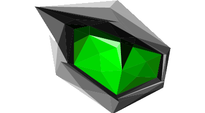

````markdown
# MONSTER Tulpar T7 V20.1  | Intel i7 (9th Gen)

[](https://www.apple.com/tr/macos/big-sur/)
[](https://github.com/acidanthera/OpenCorePkg)
[](https://github.com/sutsurup/MONSTER-Hackintosh/releases)



[Türkçe](README.md) | English

**macOS Version: 10.15.7**

**OpenCore Version: 0.6.5**

This OpenCore Hackintosh build was prepared using work by [kirainmoe](https://github.com/kirainmoe).

Helpful resources:

- [OpenCore Install Guide](https://dortania.github.io/OpenCore-Install-Guide)
- If you have a different Monster model but the *"Barebone"* number matches, you can follow this guide. I explained how to check it at the end of the guide.
- 10th generation notebooks are not fully supported yet!


# Details

    Date:         May 27, 2020
    Status:       Stable
    Support:      BIOS (N.1.04)
    Build:        OpenCore


## Hardware

| **MONSTER** | Detay                                                  |
| ------------------- | ------------------------------------------- |
| Model Ismi      | Monster Tulpar T7 V20.1      |
| Anakart           | Intel Cannon Point HM370     |
| CPU              | Intel(R) Core(TM) i7-9750H CPU @ 2.60GHz (max. 4.50GHz) Coffee Lake-H              |
| RAM           | A-Data 16 GB 2666 MHz DDR4 SDRAM    |
| Dahili Grafik Kartı | Intel(R) UHD Graphics 630 (1 GB)                     |
| Wi-Fi             | Intel(R) Wireless-AC 9560 802.11n |
| Kamera          | HD Webcam           |
| Ses       | Realtek ALC269                        |
| BIOS Versiyonu      | N.1.04                   |

# Added storage

    WDC WD10SPZX (1 TB, 5400 RPM, SATA-III) | https://cnet.co/3gpFi97

> The HDD was added to the chassis later to serve as storage; the case has a bay for HDD or SATA SSD.

# Unsupported hardware

    1. Discrete GPU (NVIDIA GeForce GTX 1660 Ti) [not supported by Apple]
    2. Intel(R) Wireless-AC 9560 (Wi-Fi card) [not supported by Apple] - See workaround later in this document -

## Compatibility
Supports **macOS Catalina 10.15.4**. You can also try running this on macOS High Sierra 10.13.6 or Mojave 10.14.6.

## Back up your data
Before starting the installation, if you have Windows, Linux, or another OS on the machine, make sure to back up important data. During disk operations or APFS formatting you may accidentally erase the wrong disk. I recommend using an online backup like [Yandex.Disk](https://disk.yandex.com.tr) or an external drive.

## What to prepare before installation
* Download the appropriate Etcher version for your OS: [Etcher](https://www.balena.io/etcher/)
* Download the RAW macOS installer image packaged by KaoS for creating the USB installer ([OSXINFO thread](https://osxinfo.net/konu/macos-catalina-amd-intel-kurulum-imaji.10455))
* Download the Kirainmoe utility and obtain the proper EFI folder for your system: [kirainmoe tool](https://github.com/kirainmoe/tongfang-hackintosh-utility/releases)


        Follow the selections shown in the screenshot and press "Get the latest config".
        I used the macOS app; you may use the Windows version if you prefer.

        Important!
        SerialNumber, MotherBoard SerialNumber and System UDID values are randomly generated.
        Be sure to change these after installation as described in the "Post-install" section of this guide.

### For HDD users

1. If you plan to install macOS onto an HDD and the HDD does not appear during installation:

    - Open an issue on the repo: [issues](https://github.com/sutsurup/MONSTER-Hackintosh/issues)
    - The kirainmoe EFI package may need patches for unsupported HDD models; I can help.

2. If the HDD is intended only for storage and it didn't appear during installation, follow the final steps in the "Post-install" section after completing installation.

# macOS Installation Instructions

1. Enter BIOS and change the following settings (press F7 to enter the BIOS menu):

    - Set SATA mode to AHCI (default is Intel RST)
    - Disable Intel Virtualization Technology
    - Disable Secure Boot

2. Use Etcher to flash the RAW macOS installer image to your USB drive.
3. Copy the BOOT and OC folders from the TongFang_EFI folder produced by the kirainmoe utility into the EFI folder on your USB.
   Remove existing BOOT and CLOVER folders on the USB EFI before pasting the new BOOT and OC folders.
4. Restart the machine and press F7 repeatedly while booting. Select your USB drive and choose the macOS installer.
5. The touchpad may not work; use a USB mouse if needed.
6. If installing macOS alongside Windows, create an Apple HFS partition as shown in this guide: [video example](https://www.youtube.com/watch?v=nvXew__fuQE). Select that disk during installation.
5. If installing only macOS: in the installer, open "Disk Utility", show all devices from the View menu, select the target disk (e.g., "Samsung SSD"), then Erase with format "APFS" and scheme "GUID Partition Map". After formatting, close the window and continue the installer selecting the new APFS volume. Repeat choosing the new APFS disk when the machine restarts until installation finishes.

The system may take longer to boot for the first few starts as it configures itself.

# Post-install recommended tools/guides (optional)
* If you plan to use iCloud, iMessage, or FaceTime, follow this guide closely: [Enable iMessage and Apple services with OpenCore](https://osxinfo.net/konu/opencore-ile-imessage-ve-apple-servislerini-aktif-etmek.16297/). The guide uses Clover Configurator as example, use OpenCore Configurator and transfer values accordingly.
* [ProperTree](https://osxinfo.net/konu/propertree-opencore-bootloader-icin-config-duzenleyici.12919/) (for editing config.plist)
* Hackintool ([Forum thread](https://www.insanelymac.com/forum/topic/335018-hackintool-v286/) | [Direct download](http://headsoft.com.au/download/mac/Hackintool.zip)) — system details and tweaks.
* Hackintool releases: [Download](https://github.com/headkaze/Hackintool/releases/tag/3.5.3)

<details>
<summary>HDD Setup Instructions</summary>

Download and extract the patches (keep MACOSX folder if present). Ensure KEXT files are extracted correctly (they should be .kext).

Install the kexts into EFI > OC > Kexts and add them to your config.plist using OpenCore Configurator.

Kexts referenced: [AHCIPortInjector.kext](https://osxinfo.net/eklentiler/ahciportinjector-kext-zip.10163/), [SATA-100-series-unsupported.kext](https://osxinfo.net/eklentiler/sata-100-series-unsupported-kext-zip.3551/), [sata-200-series-unsupported.kext](https://osxinfo.net/eklentiler/sata-200-series-unsupported-kext-zip.3550/)


</details>

# How to use Wi-Fi
The OpenIntelWireless project provides drivers to support Intel Wireless cards on macOS. See their compatibility list here: [OpenIntelWireless compatibility](https://openintelwireless.github.io/itlwm/Compat.html). This Tulpar V20.1's built-in card is supported. The kirainmoe EFI package includes itlwm.kext and Bluetooth kexts for this model—download the latest EFI from his tool and place kexts into the correct directories.

Install HeliPort to access the Wi-Fi interface: [HeliPort releases](https://github.com/OpenIntelWireless/HeliPort/releases). Drag HeliPort.app into Applications and add it to Login Items so it launches at boot.

## Contact
Website: https://sutsurup.tr // Mail: veysel@sutsurup.tr

## Other links
- [MONSTER official site](https://www.monsternotebook.com.tr)
- [hasee-tongfang-macos](https://github.com/kirainmoe/hasee-tongfang-macos)
- [hasee-tongfang-macos EN](https://github.com/kirainmoe/hasee-tongfang-macos/blob/oc-general/README-en.md)
- [RehabMan Kexts (BitBucket)](https://bitbucket.org/RehabMan/workspace/projects/PROJ)

# If you have a different Monster model
If your device's Barebone number matches one of the TongFang models supported by kirainmoe (e.g., GK7CP6R), you can follow this guide for your device as well.

How the guide will change?
1. Find your Barebone number as indicated below.
2. In the kirainmoe tool select the TongFang model matching your Barebone number.
Follow the rest of the guide as-is.

# How to find the device Barebone number

1. Check the sticker on the bottom of the machine for a code like GK7CP6RXXXXXXXXXX. Use the first 7 characters (GK7CP6R).

Current info source: https://osxinfo.net/konu/monster-cihazlar-icin-efi-kurulum-paketleri-8-9-nesil.20019

## Screenshots
<details>
<summary>Catalina</summary>


</details>

### Support the project
If you find this project useful and want to support development and resource costs, you can donate:
```
₿ 1Q8CEMHTuecxPUJpEdpRiG6Bg2GVtzw4bN
```
<a href='https://github.com/sutsurup/sutsurup/blob/main/Donate.md'></a>

QR code click leads to alternative options

### Thanks
**Yume Maruyama (kirainmoe)**, **RehabMan** (ACPI hotpatch), **LeeBinder** (README.md examples) and many others who contribute to Hackintosh communities.

Good luck!

````
